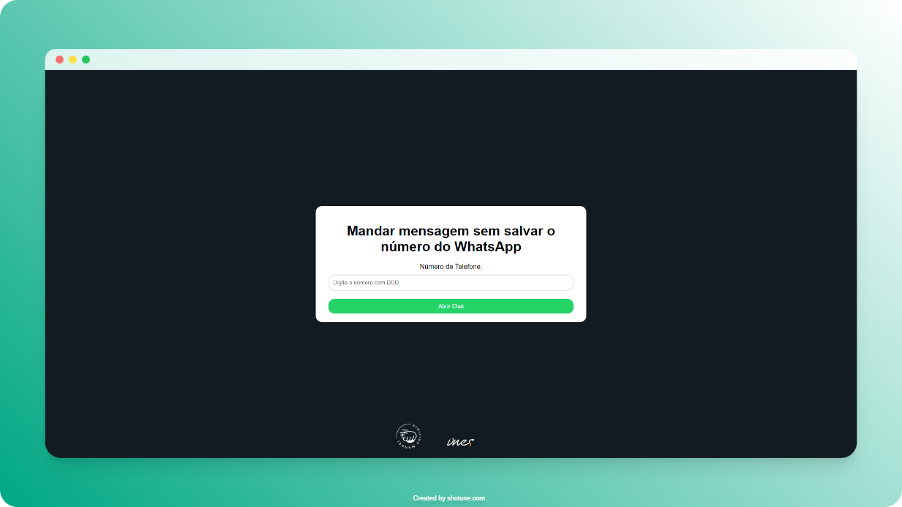

# 
WhatsApp

  
Este é um projeto simples que demonstra como abrir uma conversa do WhatsApp sem a necessidade de salvar o contato na agenda do dispositivo.

## Como Funciona
O projeto utiliza a API do WhatsApp para gerar um link que abre a conversa desejada no aplicativo. O usuário só precisa inserir o número com DDD e clicar no botão "Abrir Conversa" e será redirecionado para o WhatsApp com a conversa aberta.

[Clique AQUI!](https://vinicius.is-a.dev/wpp/)

## Contribuições
Contribuições são bem-vindas! Sinta-se à vontade para abrir issues ou enviar pull requests com melhorias, correções de bugs, ou qualquer outra sugestão.

## Licença
Este projeto está licenciado sob a [MIT License](./LICENSE).